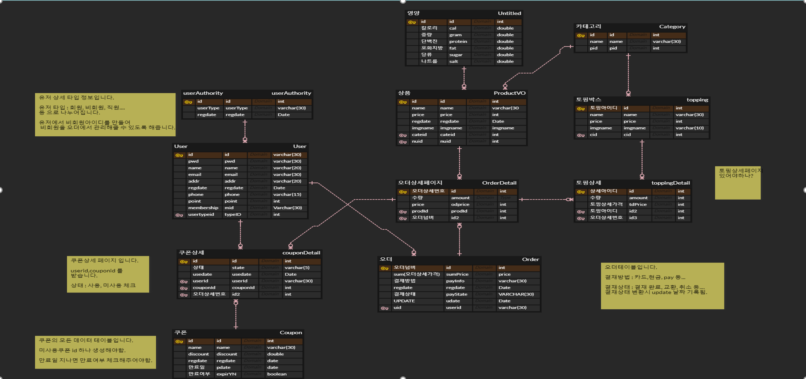

# 💎Project Collection💎

## 1. 삼성 멀티캠퍼스([14회차] AI플랫폼을 활용한 웹서비스 개발)

### (1) MultiSub Project (Semi-Project) - (기간: 6월 14일 ~ 6월 26일)

---

### [1] 프로젝트 개요

- 멀티캠퍼스 AI 플랫폼을 활용한 웹서비스 개발 14회차 세미 프로젝트 개발.
- 기본적인 CRUD 개념 및 기능 구현과 키오스크를 접목하여 공부하고 새로운 기능을 구현하는데 중점을 둠.
- Subway 전용 키오스크 화면을 구현.
- 메뉴선택 및 결제 서비스 구현

### [2] 프로젝트 역할

- 키오스크 화면 및 기능 구축 및 어드민 페이지 화면 셋팅 개발

- 기획서 및 PPT 문서 작성
  - Back-End
    - 선택한 상품에 대한 주문 목록 구현
    - 수량 선택 기능 구현
    - 수량에 대한 합계 가격 변동 기능 및 총 합계 금액 기능 구현
  - Frond-End
    - 장바구니(주문 목록) 화면 설계
    - 포장주문, 매장 식사 선택 화면 설계
    - 신용카드, 카카오페이 선택 화면 설계

### [3] 프로젝트 도구

- HW 장비
  - 노트북
  - VIEW용 태블릿
- 개발 환경도구
  - Eclipse
  - MySQL WorkBench 8.0
- 협업 도구
  - zoom
  - Discord
  - KakaoTalk
  - Git-hub
  - ERD-Cloud
- 사용 프레임워크
  - Java SpringBoot
  - Mybatis
  - BootStrap
- 사용 언어 및 기능
  - Java
  - JavaScript
  - HTML
  - CSS
  - SQL
  - Ajax
  - jQuery
  - Thymeleaf

### [4] ERD 설계

